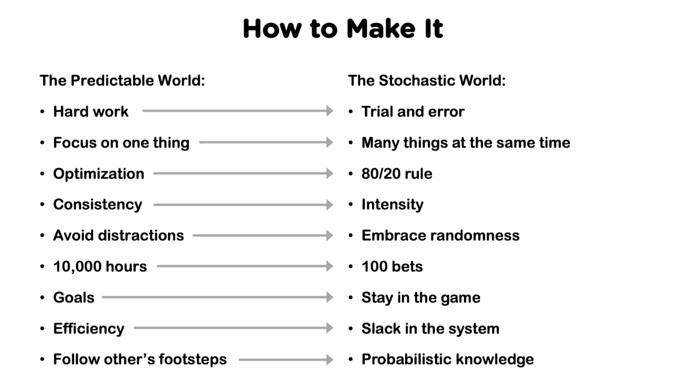

# Small Bets

Contents:

- [Small Bets](#small-bets)
  - [1. The Role of Randomness](#1-the-role-of-randomness)
    - [Uncertainty](#uncertainty)
    - [The Predictable World](#the-predictable-world)
    - [The Stochastic World](#the-stochastic-world)
    - [Stochastic Operators](#stochastic-operators)
    - [The Individual's Portfolio](#the-individuals-portfolio)
    - [The Individual's Generator](#the-individuals-generator)
    - [The Individual's Filter](#the-individuals-filter)
    - [Mapping the Predictable World to the Stochastic World](#mapping-the-predictable-world-to-the-stochastic-world)
    - [Questions](#questions)

## 1. The Role of Randomness

### Uncertainty

A business is an activity we control with an expectation of a profit.

The payoff is often uncertain; if we do consultancy work, it's easier to predict the boundaries.

Success is when payoff meets expectations; in other words, our bet meets the expectations.

What's necessary for a business to become successful? Many things, but these often are not sufficient, because we're dealing with human behavior, which is random / unpredictable.

If there is a variable which is off, the business will fail. But we don't know why! The fact is that nobody understands this world in reality.

How can we detect unpredictability (after Taleb, The Black Swan)?

- The predictable world: success is almost guaranteed if you do the correct things and put the effort. Example: learn medicine and become a doctor. 
- The stochastic world: success is randomly determined. Examples: writing a book, starting a company, etc.

### The Predictable World

The most familiar one: we study, start a job, follow the career leader, etc.

Degree of success is within a narrow range.

We have a predictable path and payoff.

It's not necessarily easy, but it's predictable and accessible.

Freelancing consultants belong to this world, because they are coupled to the physical time they invest.

### The Stochastic World

It is unfamiliar to us. 

Daniel tells the first thing he did when he quit his job was in line with the predictable world: as a SW engineer, he thought he needed to create a SW product, polish it, work hard.

However, there are wild differences in degrees of success. It is extremely competitive and unpredictable. The vast majority will fail, but there is a large upside for the winners.

Success tends to bring more success: [The Matthew Principle](https://en.wikipedia.org/wiki/Matthew_effect)

How can be learn to operate in this world? We should look at organizations or individuals that operate in it:

- Venture capitals
- Book publishers
- Movie studios
- etc.

### Stochastic Operators

How do they tame uncertainty? They bet:

- They look for authors with ideas
- They generate opportunities
- They manage parallel bets: they build a portfolio

A book on the topic: [Hollywood Economics](https://www.amazon.es/Hollywood-Economics-Uncertainty-Routledge-Contemporary/dp/0415312604). The thesis is that it's not possible to predict whether a movie will be a success. And the root of the unpredictability is human behavior. However, movie studios are very profitable: they are not on a single movie, but they build a portfolio, which is!

VCs do something similar; they know that

- Start-ups which seem like they are going to be successful can end up as a failure.
- Businesses that seem that they are not going to make it become a success.

They know they're going to have failures; the goal is to succeed at the portfolio level. Example from Statista: Penguin revenue.

They idea is to **generate randomness and opportunities and define a filter of what opportunities take or avoid.**

[Y Combinator](https://www.ycombinator.com) is an example.

Daniel thinks that ideas don't come out of the blue in the shower. They rather appear in the random interaction with the world.

### The Individual's Portfolio

- Must avoid tying all time and energy to one thing.
- Must resist believing that something will certainly work.
- Must resist the idea that you've found your best idea.
- Must treat ideas little cattle, not pets.

A full-time job comes with implicit expectations and you can't/don't have time for side hustles. In contrast, a freelancing job gives more flexibility; it's understood that you have other clients.

Daniel talks about the MVP validation approach; he thinks that it's incompatible with the stochastic world. The issue is that when we validate an idea, we think we've found the product-market fit, so we go all in, i.e., we don't have a portfolio anymore!

As an example he gives the first product he launched: Userbase. It seemed to be a success at launch day, even Paul Graham liked it -- i.e., a complete validation. But then, it didn't work. The reason is another company with similar features that seemed to work better. The worst part is he invested a lot of personal money on it.

His lesson is: we should have several projects going on, a portfolio! This also gives you more peace of mind.

Great blogpost by [Sahil Lavingia](https://sahillavingia.com/reflecting), founder of Gumroad, on the topic.

Daniel thinks AWS is actually a portfolio of around 200 products. Not all of them are successful. Amazon works like an umbrella company which has many products.

The take: we should have a portfolio of clients and jobs going on in parallel. That is a dent in the income in the short run, but an upside in the long run.

Some tricks:

- Try to have low expectations.
- Start projects as if they were small.
- Avoid big bets: don't work long on the project to ship! Long is 3 months? **Daniel tries to bring something to market in a week. A month is too much!**
- Avoid tying to identities related to businesses or projects; we're more than that and should have the freedom to choose what to be.

### The Individual's Generator

- Must have abundant spare time.
- Must be flexible to pounce on opportunities.
- Must have continuous sources of inspiration.
- Must have various capabilities.

Daniel's idea generator is Twitter, consuming his feed. He sees people doing their own thing and he comes up with ideas for his own domain. He acknowledges that most of the days nothing comes up, but there are days on which a strong signal emerges.

We should try to find something similar: something we do every day that can bring us ideas.

### The Individual's Filter

- Asymmetric bets are not enough.
- Can't take 1 in 1000 odds if you can only try 5 times.
- Go for the smallest things.
- Trade upside for higher odds of success.
- Then, success will bring with it other success.

Asymmetric bets are the ones in which we invest few, compared to what we can get.

### Mapping the Predictable World to the Stochastic World

Very important slide:

### Questions

Examples of income sources:

- SaaS. Expected to have exponential increase.
- Freelancing. Constant income.
- Info products (courses, etc.). Peaks that decay.

Daniel explains how the Small Bets community evolved as something successful even though it had not the current from in the beginning. He did one cohort and it worked, so he organized 4 more and started to invite guest talkers and paid them.

We should avoid things that have high running costs: energy, frustration, time, etc. We should rather have things that we do either happily or generate almost a passive income.

Daniel has become good at ignoring opportunities that would take longer than 1 month to bring to market. He tries to create things that can be published in one week.

